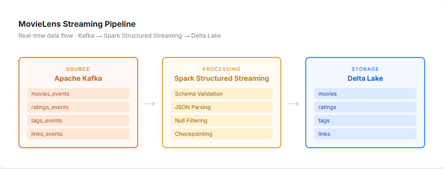

# MovieLens Streaming Data Pipeline

A real-time data streaming pipeline that ingests MovieLens dataset events from Kafka topics into Delta Lake tables using Apache Spark Structured Streaming on Databricks.

## Overview

This project implements a streaming data pipeline that:
- Consumes movie-related events from Kafka topics (movies, ratings, tags, and links)
- Processes data in real-time using Apache Spark Structured Streaming
- Stores data in Delta Lake format for efficient querying and analysis
- Supports schema enforcement and data validation

## Architecture

## Features

- **Real-time Ingestion**: Streams data from Kafka topics with configurable offsets
- **Schema Validation**: Enforces predefined schemas for movies, ratings, tags, and links
- **Delta Lake Storage**: Utilizes Delta Lake for ACID transactions and time travel capabilities
- **Partitioning**: Supports table partitioning for optimized query performance
- **Data Quality**: Automatically filters out invalid records and handles null values
- **Checkpointing**: Maintains streaming checkpoints for fault tolerance and exactly-once processing

## Architecture

The pipeline processes four main data streams:

1. **Movies** (`movies_events`) - Movie metadata including title and genres
2. **Ratings** (`ratings_events`) - User ratings for movies
3. **Tags** (`tags_events`) - User-generated tags for movies
4. **Links** (`links_events`) - External links to IMDB and TMDB

## Data Schemas

### Movies
- `movieId` (String): Unique movie identifier
- `title` (String): Movie title
- `genres` (String): Movie genres (partitioned)

### Ratings
- `userId` (String): User identifier
- `movieId` (String): Movie identifier
- `rating` (Decimal(2,1)): Rating value (supports values 0.0-9.9)
- `timestamp` (Timestamp): Rating timestamp

### Tags
- `userId` (String): User identifier
- `movieId` (String): Movie identifier
- `tag` (String): User-defined tag
- `timestamp` (Timestamp): Tag timestamp

### Links
- `movieId` (String): Movie identifier
- `imdbId` (String): IMDB identifier
- `tmdbId` (String): TMDB identifier (optional)

## Prerequisites

- Databricks workspace
- Apache Spark with Structured Streaming support
- Kafka cluster (Confluent Cloud or similar)
- Delta Lake enabled catalog
- Databricks secrets configured for Kafka authentication

## Configuration

The project requires the following Databricks secrets to be configured in the `movielens` scope:

- `confluent_api_key`: Kafka API key
- `confluent_api_secret`: Kafka API secret
- `confluent_bootstrap_servers`: Kafka bootstrap servers

## Files

- `MovieLensStructuredStreaming.py`: Main streaming pipeline implementation
- `MovieLensExploration.py`: Notebook for exploring ingested data

## Usage

### Running the Streaming Pipeline

1. Import `MovieLensStructuredStreaming.py` into your Databricks workspace
2. Ensure all secrets are properly configured
3. Run the notebook cells sequentially to start the streaming ingestion
4. Monitor the progress as data flows from Kafka to Delta tables

### Exploring the Data

1. Import `MovieLensExploration.py` into your Databricks workspace
2. Run the notebook to query and explore the ingested data
3. Use Databricks SQL or notebooks to perform analytics on the Delta tables

## Delta Tables

The pipeline creates and populates the following Delta tables (customize catalog and schema names for your environment):

- `<catalog>.<schema>.movies` (e.g., `frantzpaul_tech.movielens.movies`)
- `<catalog>.<schema>.ratings` (e.g., `frantzpaul_tech.movielens.ratings`)
- `<catalog>.<schema>.tags` (e.g., `frantzpaul_tech.movielens.tags`)
- `<catalog>.<schema>.links` (e.g., `frantzpaul_tech.movielens.links`)

**Note**: Update the table names in `MovieLensStructuredStreaming.py` to match your Databricks catalog and schema.

## Key Technologies

- **Apache Spark**: Distributed data processing engine
- **Structured Streaming**: Real-time stream processing framework
- **Delta Lake**: Storage layer providing ACID transactions
- **Apache Kafka**: Distributed event streaming platform
- **Databricks**: Unified analytics platform

## Error Handling

- Automatic handling of malformed JSON records
- Null value filtering for non-nullable fields
- `failOnDataLoss` set to false for handling Kafka topic issues
- Checkpoint-based recovery for fault tolerance

## License

This project is provided as-is for educational and demonstration purposes.
